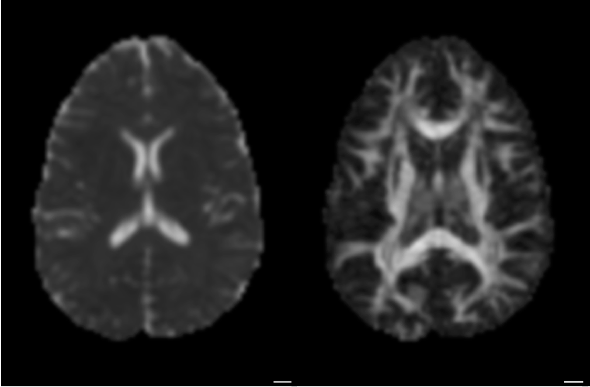
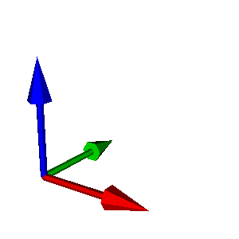

class: center, middle

# IN-VIVO VALIDATION
###of
## Diffusion MRI and tractography
## Ariel Rokem
### The University of Washington eScience Institute

<small>Follow along at: <a href="https://arokem.github.io/2017-05-04-diffusion-stats">https://arokem.github.io/2017-05-04-diffusion-stats</small>

---

layout: true

<image src="images/escience-network.png" width=500px style="opacity:0.4;filter:alpha(opacity=40);"> 

---

### White matter: the brain's super-highways

  <image src="images/optic-radiation-postmortem.png" style="background:none; border:none; box-shadow:none;" height="400">

---

### Why do we study the white matter?

--

- The biology of cognitive functions

--

- Computational models of brain structure and function

--

- Clinical relevance

---

# Normal behavior is supported by brain connections

<image src="images/OldenDays.png" style="background:none; border:none; box-shadow:none;" height="400">

<small>Image from Catani and ffytche (2015)</small>
---

<image src="images/vanessen.png" style="background:none; border:none; box-shadow:none;" height="600">

<a href="https://github.com/ericmjonas/vanessen"><small>Felleman & Van Essen, 1991</small></a>

---

# But these connections are not passive wires

--

Brain connections change with development

--

Individual differences in biology account for variance in behavior

--

The white matter adapts with learning

--

Many neurological and psychiatric disorders affect white matter biology

---

### White matter: the brain's super-highways

  <image src="images/optic-radiation-postmortem.png" style="background:none; border:none; box-shadow:none;" height="400">

--

  <image src="images/nerve-fiber.png" style="background:none; border:none; box-shadow:none;" height="400">

---

# Isotropic diffusion

<video width="600" data-setup="{}" autoplay loop>
  <source src="/video/diffusion-isotropic.mp4">
</video>

---

# Anisotropic diffusion

<video width="600" data-setup="{}" autoplay loop>
  <source src="/video/diffusion-anisotropic.mp4">
</video>

---

# Diffusion MRI

<video preload="auto" width="70%" height="auto" data-setup="{}" autoplay loop ><source src="/video/dMRI-signal-movie.mp4"/></video>

---

# Diffusion MRI

  <small>Rokem et al. (2015)</small>

---

# Diffusion MRI

  <small>Rokem et al. (2015)</small>

---

layout: false

## Models of the white matter

  <small>Basser, Mattielo and Le Bihan (1994)</small>

--

<video width="40%" autoplay loop>
  <source src="/video/tensor-signal-movie.mp4">
</video>

--

  <image src="images/q-form.png" style="background:none; border:none; box-shadow:none;" height="70">

--

<video width="70%" autoplay loop>
<source src="/video/tensor-ellipse-movie.mp4">
</video>

--

style: middle, center

#### Diffusion Tensor Model

---

# Diffusion indices

--

  

  
  

    <small>Mean diffusivity</small>
  

  

    
  

  

    
  

  

--

  

    <video width="120" autoplay loop>
    <source src="video/diffusion-fa-251.mov">
  

  

  
  

  

    <small>Fractional anisotropy</small>
  

--

  

  
  

    <small>Principal diffusion direction</small>
  

  

    
  

  

  </section>

---

# From diffusion to tracks

--

<canvas id="zoom-box" width="1000" height="1000"></canvas>

---

--

--

<canvas id="fiber" width="1000" height="1000"></canvas>

---

# Tractography

<video preload="auto" width="60%" height="auto" data-setup="{}" autoplay loop ><source src="video/cc_tube_movie.mov"/> </video>

---

## A major assumption

Well-aligned nerve fibers within the voxel

---

## An alternative to the tensor: sparse fascicle models

  

  

---

layout: center, middle

# Which model should we use?

---

### Diffusion MRI: the challenge of validation

Algorithm 1

Algorithm 2

<a href="http://arokem.org/publications/papers/Pestilli2014LiFE.pdf"><small>Pestilli et al., 2014</small></a>

---

<section>

  <medium>Measurement #1</medium>

  

--

  

  <medium>Measurement #2</medium>

--

  <canvas id="arrow-test-retest" width="1000" height="1000">
  </canvas>

    Test-retest reliability

--

  <canvas id="arrow-cv1" width="1000" height="1000">
  </canvas>

    Model

--

  <canvas id="arrow-cv2" width="1000" height="1000">
  </canvas>

--

  Cross-validation

---

  <small>Rokem et al. (2015)</small>

--

  

--

  

---

### An aside: is R-squared useless?

--

Coefficient of determination:

$$R^{2} =\frac{SS_e}{SS_t}$$

--

$$R^{2} =\frac{\sum{(y - \hat{y})^2}}{\sum{(y - \bar{y})^2}}$$

--

The [problems](http://data.library.virginia.edu/is-r-squared-useless/):

--

- Even when the model is correct, COD depends on the variance of y

--

- COD can be very close to 1, even for the wrong model

--

- COD does not track prediction error.

--

- Transformations of Y will affect COD.

---

# Relative RMSE

--

$$rRMSE =\frac{RMSE(model)}{RMSE(test-retest)}$$

--

### Upper bound

$$rRMSE < 1$$

is a good model

--

### Lower bound

$$rRMSE = \frac{1}{\sqrt{2}}$$

is a *correct* model

---

### DTI is a good model

  <small>Rokem et al. (2015)</small>

---

### But it has some issues

  <small>Rokem et al. (2015)</small>

---

          

Corticospinal tract

Superior  longitudinal fasciculus

Corpus callosum

---

### DTI has some issues

  <small>Rokem et al. (2015)</small>

---

### SFM fixes these issues

  <small>Rokem et al. (2015)</small>

---

## Are we done yet?

  <small>Rokem et al. (2015)</small>

<image src="images/rokem2015-fig6.png" height="25%">

---

layout: true

---

## What about reproducibility?

  <image src="images/gorgolewski-poldrack-three-pillars.png" style="background:none; border:none; box-shadow:none;" height="600">

---

## Reproducibility in practice

  <image src="images/arokem.png" style="background:none; border:none; box-shadow:none;" height="600">

[https://www.practicereproducibleresearch.org/](https://www.practicereproducibleresearch.org/)

---

# Neuroimaging in Python

--

<a href="http://dipy.org"><image src="images/dipy-logo.png"  height="8%"></a>

--

  <image src="images/dipy_example_xval.png" style="background:none; border:none; box-shadow:none;" height="400">

---

  <image src="images/arokem.png" style="background:none; border:none; box-shadow:none;" height="600">

---

### Cloud computing enables reproducibility

<image src="images/AWS.png" height="25%">

<image src="images/spark-logo-trademark.png" height="200px">

[K-fold cross-validation on 900 brains](https://github.com/arokem/dki-accuracy-reliability)

---

### Stay in touch!

  
  
http://arokem.org
  

  
  
arokem@gmail.com
  

  
  
@arokem
  

  
  
github.com/arokem
  

